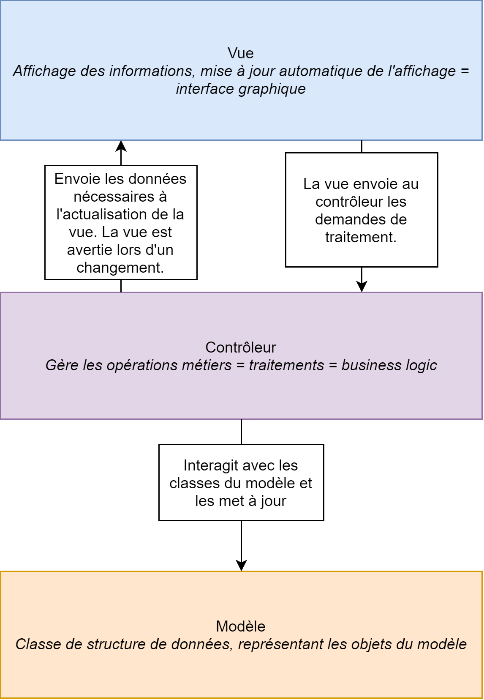
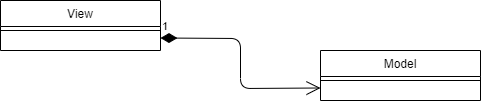

# ISI3 - MVP design pattern - "Game of Life"

Nom/Prénom: NAAJI Dorian

Lien du codesandbox: https://codesandbox.io/s/2020-isi3-mvc-doriannaaji

## Avant-propos

1. Expliquer le design pattern MVC à l'aide d'un schéma à insérer directement ici.
   Utiliser un outils commde Dia pour le représenter. Je veux **votre** schéma, pas un de ceux qu'on peut trouver sur le net.

_Figure : Mon diagramme du pattern MVC_

2. Expliquer ce pattern en complétant ce texte.

Le pattern MVC, vise à découper le `contrôleur`, de la `vue` et du `modèle` afin de rendre le code plus `lisible`.
Les responsabilités ne sont alors plus `liées`.
On peut ainsi changer l'aspect visuel de sont application sans pour autant impacter le `code de la couche métier`.

3. Expliquer dans quels cas on doit privilégier le pattern MVC.

Ce pattern est à privilégier pour les interfaces graphiques, et surtout les applications web.

On le retrouve notamment sur beaucoup de sites web reposant sur Spring MVC, Laravel, ASP.NET, etc. Avec ces frameworks, on travaille toujours en respectant le pattern MVC.

Il est également utilisé en javaFX (.fxml), WPF (.xaml) pour la gestion des interfaces d'application desktop.

Il sera en revanche rare et peu pertinent d'utiliser le pattern MVC pour un service, comme une API web... ou tout autre programme n'ayant pas ce besoin d'avoir une affichage à jour par rapport au back-end.

## A faire (obligatoire)

- Render le jeu fonctionel tout en respectant le design pattern MVC.
- Le bouton `start` doit lancer le jeu.
- Le bouton `stop` doit arrêter le jeu en l'état, le `start` relance le jeu.
- le bouton `reset` arrête le jeu et vide remet à la grille à l'état initiale.

> Réalisé. Voir code.

### Observer Observable

Afin de mettre à jour la vue à chaque nouvelle génération du jeu, la fonction `updated` doit notifier la view afin qu'elle se mette à jour.
En quoi cela relève du design pattern ObserverObservable.

1. Expliquer votre implémentation:

L'usage d'une callback permet ici de `d'appeler la méthode drawGame()` afin dire à la _View_ de se redessiner.
L'objet _Model_ n'a pas de lien avec `la vue` pourtant grâce à la `fonction de callback pointant sur drawGame()` il peut notifier la `vue si un changement a eu lieu`.

2. Insérer ici un UML montrant le pattern Observer-Observable liés aux objects de ce TP.

_Figure : UML montrant le pattern Observer-Observable_

## Optionel

> Si vous voulez apprendre d'autres choses

- Faire sorte de pouvoir changer les dimensions de la grille par in `<input/>` HTML.
- Faire en sorte de pouvoir modifier l'état d'une cellule en cliquant dessus.

## :warning: À rendre

- Une URL de codesandox pointant sur votre projet github afin que je puisse voir et tester le code.
- Le rapport complet.
